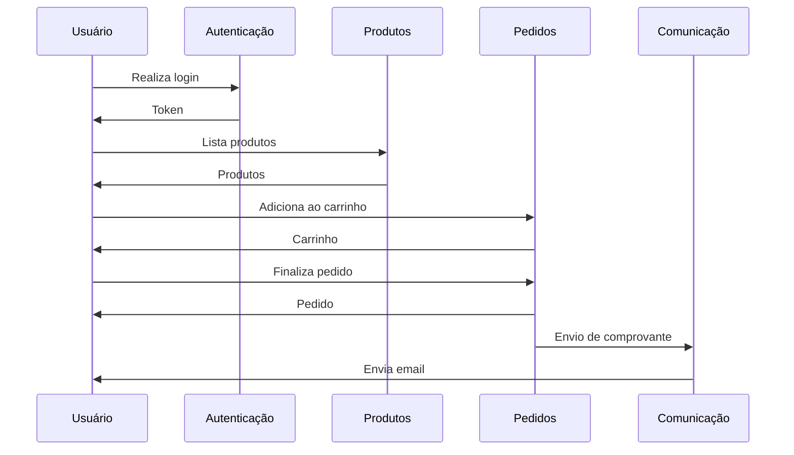

## O que é sistema baseado em microsserviços?

A arquitetura de microsserviços se baseia na divisão da aplicação em vários serviços independentes, cada um responsável por uma funcionalidade específica.

Aqui, cada módulo funciona separadamente, possui seu próprio banco de dados (ou compartilha um) e se comunica via API (HTTP, gRPC, mensageria)

## Características

### 🙌 Independência

Cada serviço pode ser desenvolvido, testado, implantado e escalado independentemente. Isso permite que equipes diferentes trabalhem em diferentes serviços.

### 🧩 Modularidade

Cada serviço é responsável por uma funcionalidade específica, o que facilita a manutenção e a evolução do sistema.

### 💪 Resiliência

Se um serviço falhar, os outros serviços continuarão funcionando. Além disso, é possível escalar cada serviço separadamente.

### 🤝 Tecnologias diversas

Cada serviço pode ser desenvolvido em uma linguagem de programação diferente, o que permite escolher a melhor tecnologia para cada funcionalidade.

## Exemplos

https://github.com/Denrox/nestjs-microservices-example

### Exemplo escrito

Um pequeno exemplo seria um sistema de e-commerce, onde teremos serviços de :

- **Usuários →** Cadastro e autenticação
- **Produtos →** Gestão e catálogo
- **Pedidos →** Gestão, carrinho, etc
- **Comunicação** → Envio de comprovantes, de cupons, etc.

Cada um desses serviços seria independente, com sua própria comunicação (via API, via RabbitMQ, etc.).

Como cada serviço se comunica com os outros pode variar, mas o importante é que cada um seja independente e possa ser escalado separadamente.

Exemplo de comunicação entre serviços:

## Pontos positivos e negativos

### ✅ Pontos positivos

- **Escalabilidade:** Cada serviço pode ser escalado separadamente, o que permite aumentar a capacidade de um serviço específico sem afetar os outros.
- **Facilidade de manutenção:** Cada serviço é independente.
- **Facilidade de desenvolvimento:** Cada serviço pode ser desenvolvido por uma equipe diferente, o que permite trabalhar em paralelo.
- **Flexibilidade tecnológica:** Cada serviço pode ser desenvolvido em uma linguagem de programação diferente, o que permite escolher a melhor tecnologia para cada funcionalidade.

### ⛔ Pontos negativos

- **Complexidade:** A arquitetura de microsserviços é mais complexa do que a arquitetura monolítica, por envolver a comunicação entre vários serviços.
- **Latência:** A comunicação entre os serviços pode adicionar latência ao sistema.
- **Consistência:** Garantir a consistência dos dados entre os serviços pode ser um desafio.
