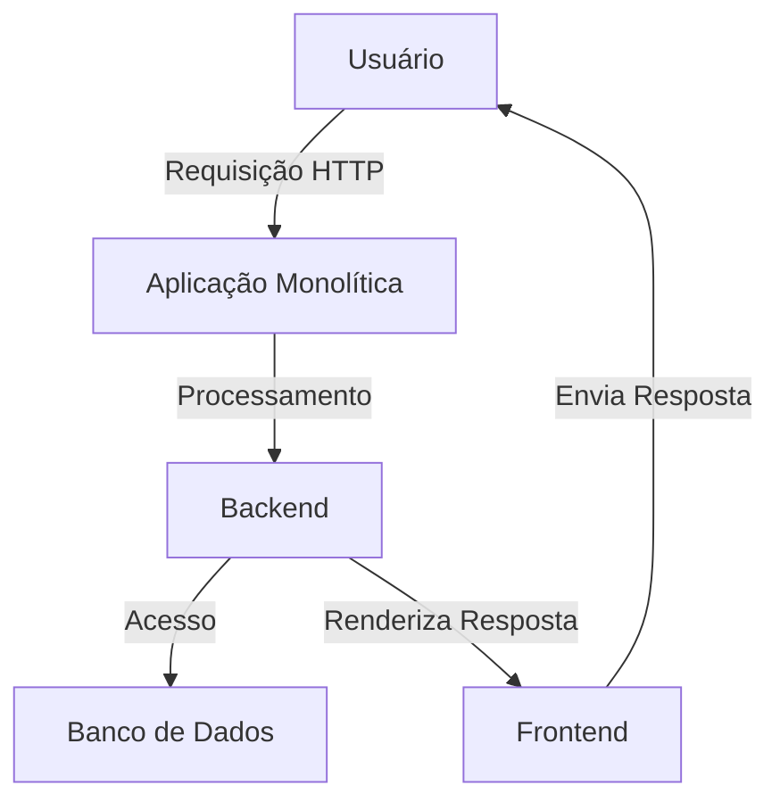

## 1. O que é um sistema Monólito/Monolith?

Um sistema é definido como monolito quando toda sua aplicação está contida dentro de apenas uma base de código/projeto. Reúne frontend, backend, banco de dados, etc.

## 2. Como funciona?

Em um sistema monolítico, todas as funcionalidades e componentes da aplicação são executados como uma única unidade. O código é compilado e implantado como um único bloco, onde todas as partes da aplicação compartilham os mesmos recursos e processo. Quando é necessário fazer uma atualização, mesmo que seja em uma pequena parte do sistema, todo o monolito precisa ser recompilado e reimplantado.

## 3. Exemplos

https://github.com/Ekoda/Monolith

https://github.com/nabeel-ncz/bytez

Exemplo de um sistema de e-commerce monolítico:

## 4. Pontos positivos e negativos

### Pontos positivos

- **Simplicidade no desenvolvimento inicial**
  Possui um desenvolvimento mais rápido, pois não há necessidade de configurar múltiplos serviços ou lidar com comunicação entre diferentes componentes. Toda a lógica está centralizada em um único lugar, facilitando o entendimento inicial do projeto.
- **Fácil de testar e debugar**
  Como todos os serviços, componentes e controles estão no mesmo projeto, é mais fácil de testar e acompanhar todo o fluxo no aplicativo.
- **Menor complexidade de deploy**
  Por estar centralizado em um projeto único, o processo de deploy é mais direto, e simples de gerenciar. Menos complexidade na infraestrutura inicial do projeto.

### Pontos negativos

- **Dificuldade de manutenção conforme o sistema cresce**
  Com o crescimento da aplicação, o código pode (e provavelmente vai) ficar muito grande, dificultando a manutenção e aumentando o risco de falhas. Terá mais “pontas amarradas”.
- **Menor escalabilidade**
  A aplicação inteira precisa ser escalada, mesmo que para apenas uma parte que esteja com maior demanda (banco de dados, por exemplo).
- **Atualizações requerem reimplantação completa**
  Qualquer mudança ou alteração vai exigir um deploy de toda a aplicação, aumentando o risco de falhas, além de “derrubar” toda a aplicação de uma vez.
- **Dificuldade para trabalhar com equipes grandes**
  Com equipes grandes, pode ser difícil trabalhar em um único projeto, a divisão de tarefas e responsabilidades pode ser mais complicada, pois uma alteração em um componente pode afetar outros componentes sem que isso seja percebido.

## 5. Quando usar?

- **Projetos pequenos**
  Para projetos pequenos, com poucos desenvolvedores e que não devem crescer muito, o monolito pode ser uma boa escolha.

- **Projetos que não precisam de escalabilidade**
  Se a aplicação não precisa de escalabilidade, o monolito pode ser uma boa escolha, pois é mais simples de gerenciar.

- **Projetos que precisam de desenvolvimento rápido**
  Para projetos que precisam ser desenvolvidos rapidamente, o monolito pode ser uma boa escolha, pois é mais simples de configurar e gerenciar.

## Quando não utilizar?

- **Projetos grandes**
  Para projetos grandes, com muitos desenvolvedores e que devem crescer muito, o monolito pode ser uma má escolha, pois pode se tornar difícil de gerenciar.

- **Equipes grandes**
  Para equipes grandes, o monolito pode ser uma má escolha, pois pode ser difícil de gerenciar e dividir as responsabilidades.

- **Implantações e atualizações frequentes**
  Para aplicações que precisam de implantações e atualizações frequentes, o monolito pode ser uma má escolha, pois pode ser difícil de gerenciar e aumentar o risco de falhas.

