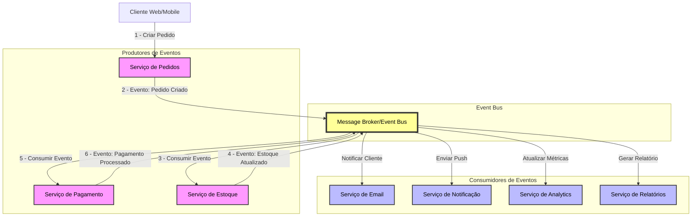
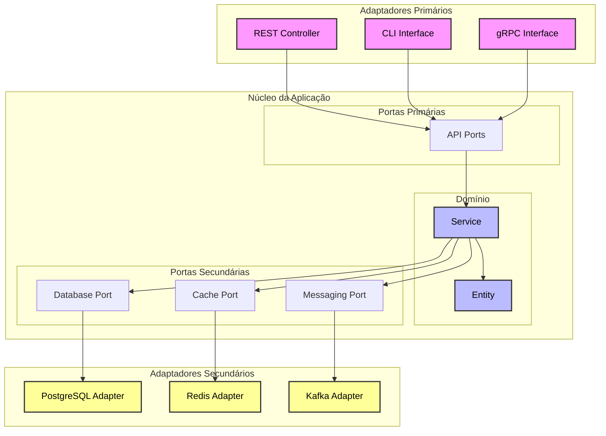

# Arquitetura Event Driven

## Definição

Os componentes e serviços se comunicam entre si através de eventos, que são mensagens que indicam que algo aconteceu em um sistema. Esses eventos podem ser gerados por diferentes fontes, como usuários, sistemas externos ou outros serviços.

Os eventos são enviados para um barramento de eventos, que é responsável por distribuir os eventos para os serviços interessados. Os serviços podem se inscrever em eventos específicos e processá-los quando ocorrerem.

## Exemplos

## Vantagens e Desvantagens

### ✅ Pontos positivos

- **Desacoplamento**
  Os serviços são desacoplados, o que significa que eles não precisam conhecer uns aos outros. Isso facilita a manutenção e a evolução do sistema.

- **Escalabilidade**
  Os serviços podem ser escalados independentemente, permitindo que o sistema se adapte a diferentes cargas de trabalho.

- **Resiliência**
  Se um serviço falhar, os outros serviços continuarão funcionando. Além disso, é possível reprocessar eventos que falharam.

### ⛔ Pontos negativos

- **Complexidade**
  A arquitetura orientada a eventos pode ser mais complexa de implementar e gerenciar, especialmente em sistemas grandes.

- **Dificuldade de depuração**
  A depuração de sistemas orientados a eventos pode ser mais difícil, pois os eventos podem ser processados em diferentes ordens e em diferentes serviços.

# Arquitetura Hexagonal

## Definição

A arquitetura hexagonal, também conhecida como Ports and Adapters, é um padrão de design de software que visa criar sistemas desacoplados e testáveis. Ela separa a lógica de negócios da infraestrutura e das interfaces do usuário, permitindo que o sistema seja facilmente adaptável a diferentes tecnologias e plataformas.

A arquitetura hexagonal é composta por três camadas principais:

- **Domínio**
  A camada de domínio contém a lógica de negócios do sistema. Ela é independente de qualquer tecnologia ou framework.

- **Portas**
    As portas são interfaces que definem como o sistema se comunica com o mundo externo. Elas podem ser usadas para receber entradas (como requisições HTTP) ou enviar saídas (como respostas HTTP).

- **Adaptadores**
    Os adaptadores são implementações concretas das portas. Eles são responsáveis por conectar o sistema a diferentes tecnologias e plataformas, como bancos de dados, serviços externos ou interfaces do usuário.

## Exemplos

