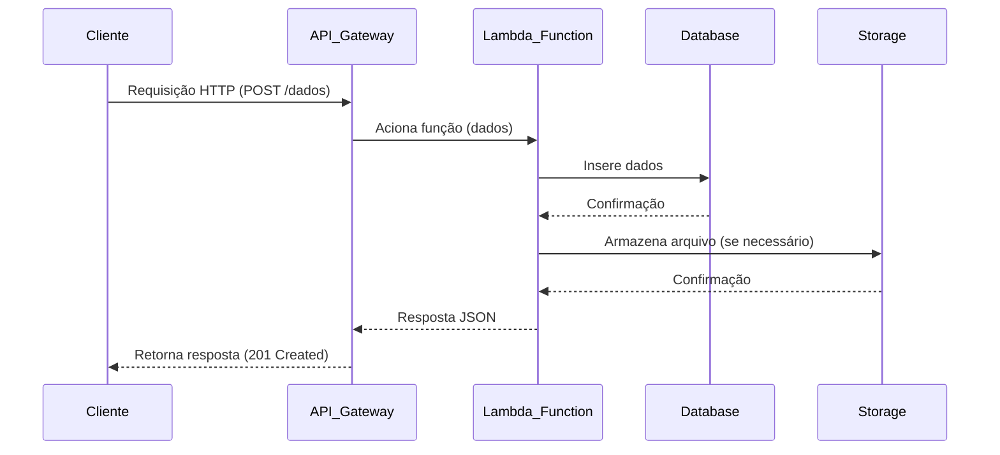

## O que é um sistema serverless?

A arquitetura serverless é um modelo de execução de aplicações em que o provedor de serviços em nuvem é responsável por executar a lógica do servidor, escalando automaticamente a infraestrutura necessária para atender à demanda dos usuários.

Aqui o desenvolvedor não precisa se preocupar com a infraestrutura, como servidores, sistemas operacionais, redes, etc. Ele apenas se preocupa com o código da aplicação.

> Serverless não significa que não há servidores, mas sim que o desenvolvedor não precisa se preocupar com a parte de infraestrutura (teoricamente).

## Características

### Desenvolvimento

O desenvolvedor escreve apenas o código da aplicação, geralmente em funções independentes (microsserviços), que são executadas em resposta a eventos.

### Implantação

O código é enviado para um provedor de nuvem (Google Cloud, AWS Lambda, Azure Functions)

### Execução sob demanda

A aplicação é executada apenas quando necessário, ou seja, quando um evento ocorre (ex: uma requisição HTTP, requisição do RabbitMQ, etc.).

### escalabilidade automática

O provedor é responsável por escalar automaticamente a infraestrutura necessária para atender à demanda dos usuários.

### Pagamento por uso

O desenvolvedor paga apenas pelo tempo de execução da aplicação, ou seja, pelo tempo que a função ficou em execução, pelos recursos utilizados, etc.

## Exemplo de arquitetura

https://github.com/serverless/serverless

## Pontos positivos e negativos

### ✅ Pontos positivos

- **Escalabilidade automática**
  O provedor é responsável por escalar automaticamente a infraestrutura necessária para atender à demanda dos usuários.

- **Redução dos custos**
  Paga-se apenas pelo tempo de execução, ou seja, não é cobrado pelo tempo em que a aplicação não está em execução.

- **Foco no código**
  O desenvolvedor não precisa se preocupar com a infraestrutura, como servidores, sistemas operacionais, redes, etc. Ele apenas se preocupa com o código da aplicação.

- **Alta disponibilidade**
  Serviços como o AWS Lambda, Google Cloud Functions e Azure Functions são altamente disponíveis, ou seja, estão sempre disponíveis para atender às requisições dos usuários.

### ⛔ Pontos negativos

- **Cold Start**
  O tempo que a aplicação leva para iniciar quando não está em execução. Isso pode causar lentidão na resposta da aplicação.

- **Limitações de tempo de execução**
  Cada provedor tem um limite de tempo de execução para as funções. Por exemplo, o AWS Lambda tem um limite de 15 minutos.

- **Depuração e Monitoramento**
  Pode ser mais complexo depurar e monitorar aplicações serverless, pois a execução é distribuída e pode envolver vários serviços.

- **Vendor Lock-In**
  A dependência de um provedor específico pode dificultar a migração para outra plataforma no futuro.

## Quando usar?

- **Aplicações baseadas em eventos**
    Quando é necessário executar tarefas sob demanda, como processamento de arquivos, processamento de mensagens em filas, notificações via webhooks

- **APIs REST ou GraphQL**
    Quando é necessário criar APIs que respondem a requisições HTTP, que servem de comunicação entre o frontend e o backend.

## Quando não utilizar?

- **Aplicações com alta carga de trabalho constante**
    Quando a aplicação tem uma carga de trabalho constante, pode ser mais econômico e eficiente usar servidores dedicados ou contêineres.

- **Aplicações com baixa latência constante**
    Quando a aplicação precisa de baixa latência constante, pode ser mais eficiente usar servidores dedicados ou contêineres.
