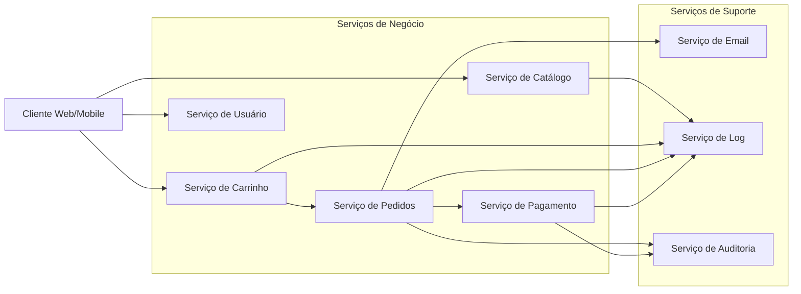

## O que é um sistema baseado em SOA?

A arquitetura orientada a serviços (SOA) é um estilo de arquitetura de software que permite que diferentes serviços se comuniquem entre si, independentemente da plataforma ou tecnologia utilizada. Cada serviço é uma unidade funcional independente que pode ser desenvolvida, implantada e gerenciada separadamente.

## Como funciona?

Em um sistema SOA, os serviços se comunicam entre si por meio de mensagens, geralmente usando protocolos padrão como HTTP, SOAP ou REST. Cada serviço é responsável por uma funcionalidade específica e pode ser desenvolvido em diferentes linguagens de programação ou plataformas.

O SOA promove a reutilização de serviços, permitindo que diferentes aplicações utilizem os mesmos serviços. Isso reduz a duplicação de código e facilita a manutenção do sistema.

## Exemplos

## Pontos positivos e negativos

### ✅ Pontos positivos

- **Reutilização de serviços**
  Os serviços podem ser reutilizados em diferentes aplicações, reduzindo a duplicação de código e facilitando a manutenção.

- **Flexibilidade**
  Os serviços podem ser desenvolvidos em diferentes linguagens de programação ou plataformas, permitindo que as equipes escolham as melhores tecnologias para cada serviço.

- **Escalabilidade**
  Os serviços podem ser escalados independentemente, permitindo que o sistema se adapte a diferentes cargas de trabalho.

- **Interoperabilidade**
  Os serviços podem se comunicar entre si, independentemente da plataforma ou tecnologia utilizada.

### ⛔ Pontos negativos

- **Complexidade**
  A arquitetura SOA pode ser mais complexa de implementar e gerenciar do que outras arquiteturas, como o monolito.

- **Desempenho**
  A comunicação entre serviços pode adicionar latência ao sistema, especialmente se os serviços estiverem distribuídos em diferentes servidores ou data centers.

- **Gerenciamento de serviços**
  Gerenciar e monitorar vários serviços pode ser desafiador, especialmente em sistemas grandes e complexos.

## Quando usar?

- **Sistemas grandes e complexos**
  Quando o sistema é grande e complexo, a arquitetura SOA pode ser uma boa escolha, pois permite dividir o sistema em serviços menores e mais gerenciáveis.

- **Necessidade de reutilização de serviços**
    Quando há necessidade de reutilizar serviços em diferentes aplicações, a arquitetura SOA pode ser uma boa escolha.

- **Sistema legado**
  Quando há um sistema legado que precisa ser modernizado, a arquitetura SOA pode ser uma boa escolha, pois permite integrar novos serviços com o sistema existente.

## Quando não utilizar?

- **Sistemas pequenos e simples**
  Quando o sistema é pequeno e simples, a arquitetura SOA pode ser uma má escolha, pois pode adicionar complexidade desnecessária.

- **Orçamento limitado**
    Quando o orçamento é limitado, a arquitetura SOA pode ser uma má escolha, pois pode exigir mais recursos e tempo para implementar e gerenciar.

- **Necessidade de desenvolvimento rápido**
    Quando há necessidade de desenvolver rapidamente, a arquitetura SOA pode ser uma má escolha, pois pode exigir mais tempo para implementar e gerenciar.
